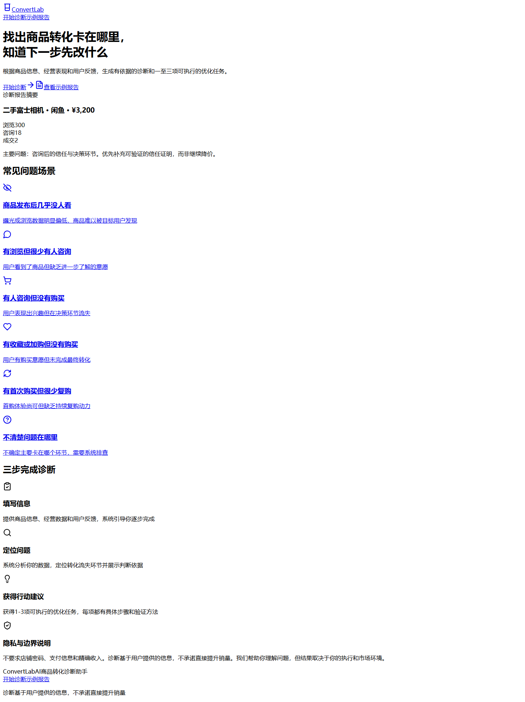
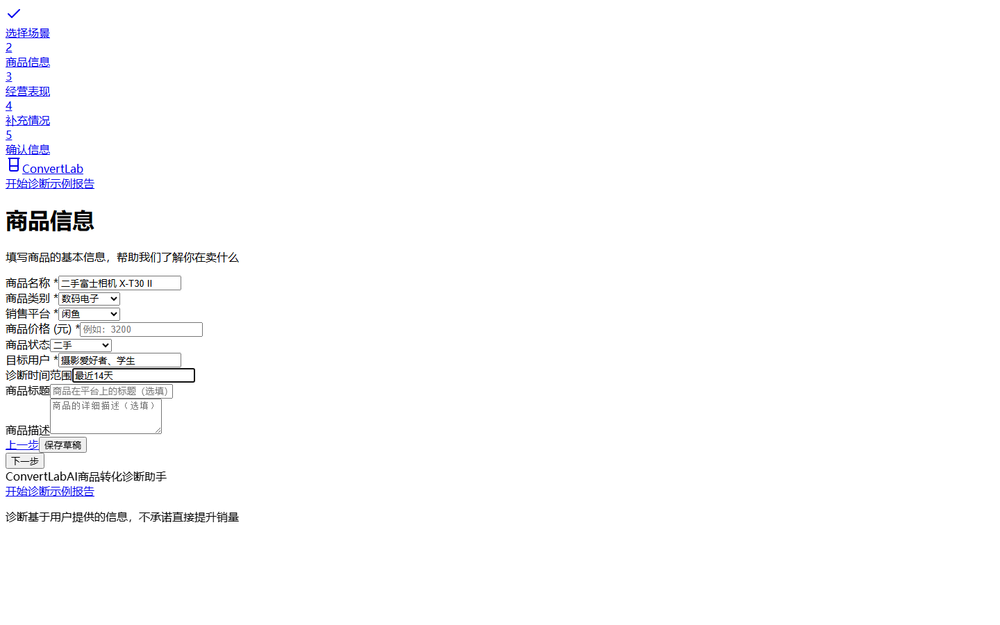
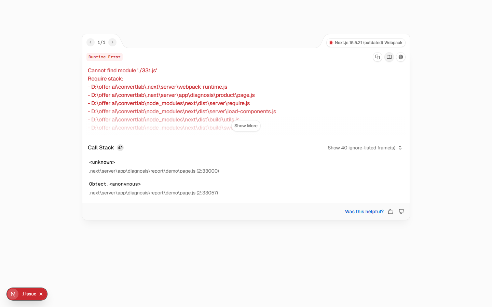

# ConvertLab｜AI 商品转化诊断助手

面向个人卖家和轻量经营者，通过商品信息、经营数据和用户反馈，定位主要转化问题，并输出有依据、可执行的优化任务。


---

## 1. 在线体验

> 在线体验：待 Vercel 部署

GitHub：[https://github.com/Mihutr/convertlab-ai](https://github.com/Mihutr/convertlab-ai)

<!-- 部署后替换为 Vercel 地址 -->

---

## 2. 项目背景

个人卖家在日常经营中经常遇到以下问题：

- 商品发布后几乎没人看；
- 有浏览但很少有人咨询；
- 有人咨询但没有购买；
- 有收藏或加购但没有成交；
- 有首次购买但很少复购；
- 感觉商品表现不好，但不知道先改什么。

通用 AI 工具在处理这类问题时，往往因为缺少商品上下文和经营数据，只能生成泛化的建议（如"优化标题""调整价格"），无法针对具体商品的实际情况给出有依据的判断。

---

## 3. 产品目标

ConvertLab 帮助用户回答三个核心问题：

1. **商品主要卡在哪个转化环节** — 曝光、浏览、咨询、购买还是复购；
2. **系统为什么这样判断** — 展示本次判断所依据的事实和知识证据；
3. **下一步应该优先做什么** — 输出 1—3 项可执行的优化任务，每项附验证方法。

---

## 4. 目标用户

| 用户类型 | 典型场景 |
|---------|---------|
| 闲鱼个人卖家 | 清理闲置物品，但不了解平台运营 |
| 校园团购负责人 | 有一定流量，但转化效率低 |
| 微信群/朋友圈卖家 | 依赖社交关系卖货，缺乏数据分析 |
| 内容平台轻量卖家 | 在抖音、小红书等平台兼顾带货 |
| 个体经营者 | 没有专业运营团队，需要轻量诊断工具 |

---

## 5. 核心产品流程

```
进入首页
    │
    ▼
选择问题场景（六选一）
    │
    ▼
填写商品信息（名称、类别、平台、价格、状态、目标用户）
    │
    ▼
填写经营数据（曝光、浏览、收藏、加购、咨询、成交、首购、复购）
    │
    ▼
补充用户反馈（常见咨询、拒绝原因、已尝试调整及结果）
    │
    ▼
信息完整度检查（基本充分 / 信息不足 / 严重不足）
    │
    ▼
确认信息 → 生成诊断报告
    │
    ▼
查看证据与行动任务 → 提交用户反馈
```

---

## 6. 已实现功能

### 诊断流程

- [x] 六类商品转化问题场景（无浏览 / 有浏览无咨询 / 有咨询无购买 / 收藏未转化 / 首购无复购 / 不清楚问题）
- [x] 五步结构化诊断流程 + 进度指示器
- [x] 商品信息表单（名称、类别、平台、价格、状态、目标用户、时间范围、标题、描述）
- [x] 经营数据表单（曝光、浏览、收藏、加购、咨询、成交、首购、复购），每个字段支持"已知 / 不知道 / 不适用"
- [x] 用户反馈与销售情况补充（常见咨询、停止沟通节点、多选拒绝原因标签、已尝试调整及结果）
- [x] 数据冲突检测（咨询人数 > 浏览量、成交量 > 浏览量时提示）
- [x] 三种信息完整度状态（基本充分 / 信息不足 / 严重不足），不足时给出补充问题
- [x] 确认页面，按模块展示已填写信息摘要，支持跳回修改

### 交互与状态

- [x] Zod + React Hook Form 表单校验
- [x] localStorage 草稿实时保存，刷新页面数据不丢失
- [x] 步骤守卫（Step Guard），未完成前置步骤无法跳转
- [x] 模拟诊断生成动画（5 步渐进式状态，3—4 秒后自动进入报告页）
- [x] 页面间"上一步 / 下一步 / 保存草稿"导航

### 诊断报告

- [x] 信息完整度 + 诊断可信度标签
- [x] 主要问题 + 一句话摘要
- [x] 已知事实列表
- [x] 可能原因卡片（证据较强 / 有一定可能 / 需要验证）
- [x] 判断依据证据卡片（支持展开查看详情，标注证据等级 A/B/C 和来源）
- [x] 优先行动任务卡片（优先级、成本、观察周期）
- [x] 行动任务详情抽屉（执行步骤、可复制文案模板、验证方法）
- [x] 任务采纳 / 不适用标记
- [x] 验证方式说明
- [x] 风险提示
- [x] 用户反馈（准确度 1—5 分、有用度 1—5 分、是否采纳、不适用原因、开放文本）

### 响应式设计

- [x] PC 端卡片网格布局
- [x] 移动端单列布局，主按钮占满宽度
- [x] 表单在移动端垂直排列
- [x] 导航在移动端通过文本链接展示

---

## 7. 诊断报告设计

报告将信息分为三个层次，避免把 AI 推测包装成确定结论：

| 层级 | 内容 | 目的 |
|------|------|------|
| **已知事实** | 用户提供的确切数据 | 明确诊断前提 |
| **可能原因** | 基于规则的推论，标注证据强度 | 区分确定与不确定 |
| **行动建议** | 可执行的优化任务，附验证方法 | 聚焦下一步动作 |

报告包含以下模块：

- **数据完整度与可信度**：让用户了解本次诊断的可靠程度
- **主要问题与摘要**：一句话定位核心问题
- **已知事实**：逐条列出诊断所依据的原始数据
- **可能原因**：按证据强度分级的推论，避免"一定是因为价格"这类武断结论
- **判断依据**：可展开的证据卡片，说明每条推论的知识来源
- **优先行动任务**：1—3 项，每项包含步骤、文案模板和验证方法
- **验证方式**：建议观察周期和关键指标
- **风险提示**：说明当前诊断的局限性

---

## 8. 当前演示案例

当前版本使用以下 Mock 案例验证产品流程和报告交互：

| 字段 | 内容 |
|------|------|
| 商品 | 二手富士相机 |
| 平台 | 闲鱼 |
| 价格 | ¥3,200 |
| 周期 | 最近 14 天 |
| 浏览 | 300 |
| 收藏 | 15 |
| 咨询 | 18 |
| 成交 | 2 |
| 常见咨询 | 是否正品、能否便宜、有没有售后 |
| 已尝试调整 | 降价和修改标题，成交没有明显变化 |
| 主要诊断 | 咨询后的信任与决策环节 |

> 该案例仅用于验证产品流程和报告交互，不代表真实商家经营结果。

---

## 9. 页面截图

| 首页 | 诊断表单 | 诊断报告 |
|------|---------|---------|
|  |  |  |

> 截图待补充。请将对应截图放入 `docs/images/` 目录，文件名分别为 `home.png`、`diagnosis-form.png`、`report.png`。

---

## 10. 技术栈

| 分类 | 技术 | 用途 |
|------|------|------|
| 框架 | Next.js 15 (App Router) | 页面路由与 SSR |
| 语言 | TypeScript | 类型安全 |
| 样式 | Tailwind CSS | 原子化 CSS |
| 表单 | React Hook Form + Zod | 表单状态管理与校验 |
| 状态管理 | React Context + useReducer | 诊断流程状态 |
| 图标 | Lucide React | 图标库 |
| 持久化 | localStorage | 草稿保存 |
| 构建 | npm | 包管理 |

---

## 11. 项目目录

```
convertlab-ai/
├── public/                              # 静态资源
├── src/
│   ├── app/                             # 页面和路由（Next.js App Router）
│   │   ├── page.tsx                     # 首页
│   │   ├── layout.tsx                   # 根布局
│   │   ├── globals.css                  # 全局样式与品牌色变量
│   │   ├── example/
│   │   │   └── page.tsx                 # 示例报告页
│   │   └── diagnosis/
│   │       ├── layout.tsx              # 诊断流程布局（含进度条）
│   │       ├── scenario/               # 第1步：选择场景
│   │       ├── product/                # 第2步：商品信息
│   │       ├── metrics/                # 第3步：经营表现
│   │       ├── context/                # 第4步：补充情况
│   │       ├── completeness/           # 信息完整度检查
│   │       ├── confirm/                # 第5步：确认信息
│   │       ├── generating/             # 模拟生成
│   │       └── report/demo/            # Mock 诊断报告
│   ├── components/
│   │   ├── layout/                     # Navbar、Footer
│   │   └── diagnosis/                  # ProgressBar、StepNavigation
│   ├── contexts/
│   │   └── DiagnosisContext.tsx         # 诊断流程全局状态
│   ├── hooks/
│   │   ├── useDiagnosis.ts             # Context 访问 Hook
│   │   ├── useStepGuard.ts             # 步骤守卫
│   │   └── useLocalStorage.ts          # localStorage 通用 Hook
│   ├── lib/
│   │   ├── constants.ts                # 步骤、场景、平台、类别常量
│   │   ├── mock-data.ts                # Mock 诊断报告与场景数据
│   │   ├── validators.ts               # Zod 表单校验 Schema
│   │   ├── storage.ts                  # localStorage 读写工具
│   │   └── utils.ts                    # cn() 样式合并工具
│   └── types/
│       └── diagnosis.ts                # 全部 TypeScript 类型定义
├── docs/images/                         # 截图（待补充）
├── next.config.ts
├── tailwind.config.ts
├── tsconfig.json
└── package.json
```

---

## 12. 本地运行

```bash
# 克隆仓库
git clone https://github.com/Mihutr/convertlab-ai.git
cd convertlab-ai

# 安装依赖
npm install

# 启动开发服务器
npm run dev
```

访问 [http://localhost:3000](http://localhost:3000)。

其他命令：

```bash
npm run lint    # ESLint 检查
npm run build   # 生产构建
```

---

## 13. 产品设计亮点

- **结构化输入优先于开放聊天**：将诊断信息拆分为场景选择、商品表单、经营数据和用户反馈四步，降低用户表达成本，同时保证输入质量
- **空值、0、"不知道"和"不适用"严格区分**：经营数据表单中，空白不被自动视为 0，每个字段允许用户明确标记"不知道"或"不适用"
- **信息不足时先追问而不是强行诊断**：完整度检查页面根据已填数据评分，不足时给出 1—3 个补充问题
- **一次只突出一个主要问题**：报告聚焦当前最值得优先处理的转化环节，避免信息过载
- **建议控制在 1—3 项**：每项按优先级排序，标注成本（低/中/高）和观察周期（7 天）
- **每项建议都有验证方法**：不光说"做什么"，还说明"怎么知道做对了"
- **用户反馈形成闭环**：诊断准确度和有用度评分、是否采纳、不适用原因，为后续迭代提供数据基础

---

## 14. AI 与 RAG 规划

### 当前版本（V0.1 MVP）

- 使用固定 Mock 诊断报告验证产品流程
- 尚未调用真实大模型（LLM）
- 尚未建立真实知识库
- 当前重点是验证产品流程和交互体验

### 下一阶段规划

- 接入 Coze 工作流，替换 Mock 数据为真实 AI 输出
- 建立商品转化知识库（运营规则 + 案例）
- 增加 Metadata 过滤，提高检索精度
- 增加混合检索（BM25 + Embedding）和 Rerank
- 输出可追溯来源的证据引用
- 建立 RAG Evaluation Harness
- 接入 Supabase，持久化诊断记录和用户反馈
- 收集真实用户反馈并迭代 prompt 和知识库

---

## 15. Evaluation Harness 规划（规划中）

> 以下内容均为**规划中**，尚未实施。

后续将对 RAG 诊断系统进行以下维度的评测：

| 评测维度 | 说明 |
|---------|------|
| 信息完整度判断准确率 | 是否正确识别数据是否够用 |
| 漏斗环节判断命中率 | 诊断的主要卡点是否合理 |
| 检索命中率（Recall@k） | 知识库检索是否命中了相关条目 |
| 引用准确率（Precision） | 证据卡片引用的知识是否与结论一致 |
| Faithfulness | 输出内容是否忠于检索结果，有无编造 |
| 信息不足正确追问率 | 数据不足时是否提出了有效追问 |
| 结构化输出成功率 | AI 输出是否符合预定 JSON Schema |
| 新旧版本回归对比 | 改 prompt 或换模型后诊断质量是否下降 |

---

## 16. 隐私与产品边界

- 不要求店铺密码、支付信息或精确收入
- 当前版本数据保存在浏览器 localStorage
- Mock 版本不上传真实经营数据
- AI 诊断基于用户提供的信息，不承诺直接提升销量
- 诊断结论仅供参考，不构成专业经营建议

---

## 17. 产品版本规划

| 版本 | 重点 | 状态 |
|------|------|------|
| V0.1 | 高保真交互原型，完整诊断流程，Mock 报告 | ✅ 已完成 |
| V0.2 | Coze 工作流接入，基础 RAG 知识库 | 🔲 规划中 |
| V0.3 | Supabase 持久化，用户日志与反馈收集 | 🔲 规划中 |
| V0.4 | Evaluation Harness，RAG 检索与 Prompt 调优 | 🔲 规划中 |
| V1.0 | 用户测试，作品集发布 | 🔲 规划中 |

---

## 18. 项目文档

| 文档 | 状态 |
|------|------|
| 产品立项文档 | 整理中 |
| 用户调研方案 | 整理中 |
| 竞品分析 | 整理中 |
| PRD | 整理中 |
| 原型说明 | 整理中 |
| RAG 评测报告 | 规划中 |
| 用户反馈和迭代记录 | 规划中 |

---

## 19. 作者

**陶锐**

- 方向：C 端产品经理 / AI 产品经理
- 邮箱：1210822134@qq.com
- GitHub：[https://github.com/Mihutr](https://github.com/Mihutr)

---

## 20. 更新日志

### 2026-07｜MVP V0.1

- 完成 10 个主要页面（首页 + 6 步诊断流程 + 报告 + 示例 + 生成状态）
- 完成六类问题场景选择与五步诊断流程
- 完成商品信息、经营数据和用户反馈表单及其校验
- 完成信息完整度三种状态的判断与展示
- 完成 localStorage 草稿实时保存与恢复
- 完成步骤守卫（Step Guard），防止跳过必要步骤
- 完成诊断报告：已知事实、可能原因、证据卡片、行动任务、验证方式、风险提示
- 完成行动任务采纳/不适用标记和详情抽屉（含可复制文案）
- 完成用户反馈评分与提交
- 完成 PC 与移动端响应式适配
- 通过 TypeScript 类型检查和生产构建

---

*Made with Next.js, TypeScript & Tailwind CSS*
